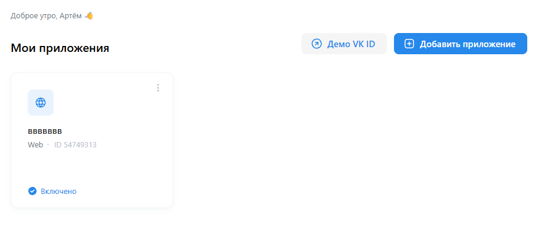

# VK Tokens Automate
Автоматизация создания VK-приложения и получения OAuth-токенов для работы с VK API с помощью Python и Selenium, используемого совместно с ChromeDriver.


Проект позволяет автоматически пройти основную часть процесса настройки VK-приложения: проверить наличие приложения, создать его при необходимости, настроить Web-приложение, сформировать OAuth-ссылку и получить OAuth-токены.


## Автоматизированные действия
- проверка существования VK-приложения по названию;
- автоматическое создание приложения, если оно отсутствует;
- выбор типа приложения Web;
- настройка домена и Redirect URI;
- получение `client_id`
- генерация PKCE `code_verifier` и `code_challenge`;
- формирование OAuth URL;
- получение `authorization_code` и `device_id`;
- получение OAuth-токенов через VK API.


## Стэк
- Python 3.14+
- Selenium 4.49.0
- VK API


## Установка
### 1. Клонирование репозитория
```
git clone https://github.com/aandermai/vk-tokens-automate.git 
cd vk-tokens-automate
```
### 2. Создание и запуск виртуального окружения
Для того, чтобы создать виртуальное окружение, используйте в терминале команду: `python -m venv .venv`


Для активации приложения введите команду, соответсвующую вашей ОС

**Windows**:
`.venv\Scripts\activate`


**MacOS/Linux**:
`source .venv/bin/activate`


### 3. Установка зависимостей и запуск
Для установки сторонних библиотек, используемых в проекте, введите в терминал следующую команду: `pip install -r requirements.txt`.


После установки, чтобы запустить программу, введите в консоль: `python main.py`


## Руководство пользователя 
### Шаг 1. Авторизация в VK
После запуска проекта откроется страница VK ID, где необходимо авторизоваться в своём аккаунте VK. После успешной авторизации вас должно перекинуть на страницу с приложениями: 
Если страница имеет вид, как показано на скриншоте, то вернитесь в терминал и нажмите `Enter`.


### Шаг 2. Проверка приложения
Программа проверит, существует ли VK-приложение с указанным названием в константе `APP_NAME` файла `main.py`. Если приложение существует, то программа получит его `client_id` и продолжит работу. В ином случае, программа автоматически перейдёт к его созданию.


### Шаг 3. Создание приложения
Если приложение отсутствует, программа:

1. откроет форму создания приложения;
2. введёт название приложения;
3. выберет тип приложения `Web`;
4. укажет домен;
5. укажет Redirect URI;
6. создаст приложение;
7. получит `client_id`.


### Шаг 4. OAuth-авторизация
После настройки приложения программа сформирует OAuth-ссылку и откроет её в браузере.


Необходимо:
1. подтвердить предоставление запрашиваемых разрешений;
2. дождаться автоматического перенаправления на Redirect URI.


После перенаправления программа самостоятельно получит `authorization_code`и `device_id`.


### Шаг 5. Получение токена
Полученные данные используются для обмена `authorization_code` на OAuth-токены. После успешного завершения токены сохраняются в файл, указанный в константе `TOKENS_FILE` файла `main.py`.


## Настройка
Основные параметры находятся в `main.py`:
```python
APP_NAME = "VK Video Views"
DOMAIN_NAME = "vk.com"
REDIRECT_URI = "https://oauth.vk.com/blank.html" 
TOKENS_FILE = "tokens.json"
```

### `APP_NAME`
Название VK-приложения.

Если приложение с таким названием уже существует, программа будет использовать его вместо создания нового.

### `DOMAIN_NAME`
Домен, который используется при настройке Web-приложения.

### `REDIRECT_URI`
Адрес, на который VK перенаправляет пользователя после OAuth-авторизации.

### `TOKENS_FILE`
Файл, в который сохраняется полученные OAuth-токены.


## Структура проекта
### `main.py`
Основной файл программы. Управляет последовательностью выполнения:

- авторизация;
- проверка приложения;
- создание приложения;
- генерация PKCE;
- OAuth-авторизация;
- получение токена.

### `vk/app.py`
Функции, связанные с VK-приложением:

- поиск приложения;
- создание приложения;
- настройка параметров приложения;
- получение `client_id`.

### `vk/oauth.py`
Функции, связанные с OAuth:

- генерация PKCE;
- создание OAuth URL;
- получение параметров после авторизации;
- обмен `authorization code` на OAuth-токен.

## Безопасность
OAuth-токен предоставляет доступ к разрешённым API-методам VK, поэтому его нельзя публиковать в GitHub или передавать посторонним.

Файлы с токенами рекомендуется добавить в `.gitignore`.

## Ограничения
Проект автоматизирует техническую часть OAuth-процесса, но пользователь самостоятельно проходит авторизацию в VK и подтверждает предоставление доступа.

Проект не предназначен для обхода CAPTCHA, двухфакторной аутентификации или других механизмов защиты VK.
